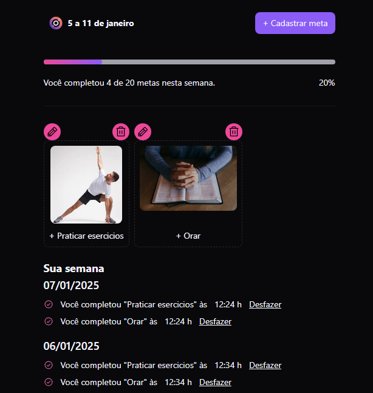

# Meu Projeto  

Este projeto utiliza "in orbit" para realizar as metas de acordo com seus objetivos.

## Tecnologias  

* Backend: typescript, Express, [Banco de Dados (SQLite ou MongoDB)]  
* Frontend: typescript, vite, react  

## Pré-requisitos  

* Node.js e npm instalados.  
* docker e docker compose (ou casoqueira configurar com o mongdb).  

## Instalação  

1. Clone o repositório: `git clone [URL do repositório]`  
2. Navegue até o diretório do projeto: `cd [Nome do Repositório]`  

## Configuração  

**Escolha um banco de dados:**  

### SQLite  

1. Instale as dependências: `npm ci`  
2. Renomeie `.env.example` para `.env` e configure as variáveis de ambiente.  
3. Configure o arquivo `schema.prisma`.  
4. Execute as migrations: `npx prisma migrate dev`  

### MongoDB  

1. Instale as dependências: `npm ci`  
2. Renomeie `.env.example` para `.env` e configure as variáveis de ambiente.  
3. Execute as migrations: `npx prisma generate` e `npx prisma db push`  

## Inicializando o projeto  

### Backend  

Execute: `npm run dev`  

### Frontend  

1. Instale as dependências: `npm ci`  
2. Execute: `npm run dev`  
 

## Licença  

[Informações de licença]  